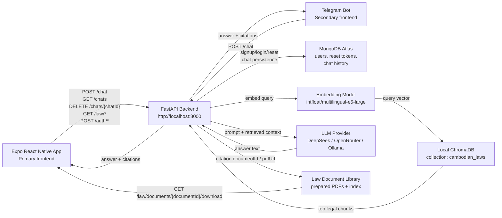

# LawKh System Diagram

## Architecture Map

## Main API Surface

- `POST /chat`: RAG answer generation. Public endpoint; saves history when a bearer token is provided.
- `GET /chats`: list saved chat history.
- `GET /chats/{chatId}`: open a saved chat.
- `DELETE /chats/{chatId}`: delete a saved chat.
- `POST /auth/signup`: create account in MongoDB.
- `POST /auth/login`: return JWT access token.
- `POST /auth/password/forgot`: MVP reset-token flow.
- `POST /auth/password/reset`: update password by reset token.
- `GET /law/categories`: list law categories.
- `GET /law/categories/{categoryId}/documents`: list source documents in a category.
- `GET /law/documents/{documentId}`: return document metadata and file URLs.
- `GET /law/documents/{documentId}/download`: return original PDF inline.
- `GET /citations/{citationId}`: return rich citation metadata and source document link.

## Deployment / Demo Notes

For the local demo, the backend runs on `http://localhost:8000`, the Expo Android emulator can call `http://10.0.2.2:8000`, and the Telegram bot polls Telegram while calling the same backend `/chat` endpoint. Secrets such as DeepSeek/OpenRouter keys, Telegram token, and MongoDB URI stay in backend `.env`; they are not placed inside the Expo APK.
